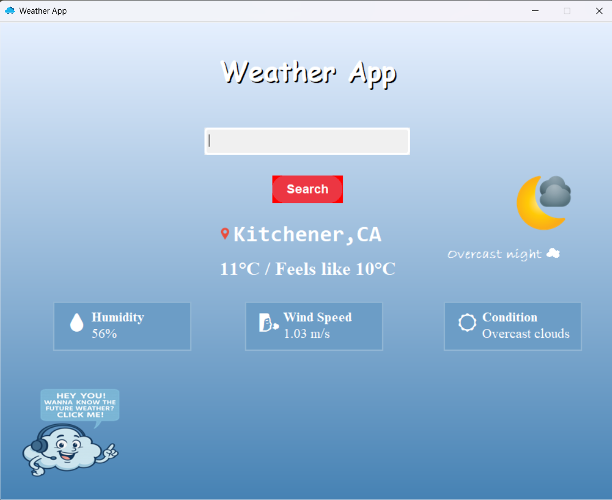

# Weather App

This is a simple weather app built using Python, Tkinter, `customtkinter`, OpenWeatherMap API, and pyttsx3 for text-to-speech functionality. The app allows users to search for weather information by city and provides spoken feedback about the current weather.

## Features

- Search weather information by city name.
- Display current temperature and weather description.
- Text-to-speech feature to read the weather aloud.
- Modern UI with `customtkinter` for a sleek design.
- Error handling for invalid cities or API issues.

## Installation

### Prerequisites

Make sure you have Python 3.6+ installed on your machine.

### Dependencies

1.Clone the repository:

  
   git clone https://github.com/yourusername/SreejaDevWorks.git
   cd SreejaDevWorks
   
2.Install required Python packages:

pip install customtkinter
pip install Pillow
pip install requests
pip install pyttsx3

3.Get an API key from OpenWeatherMap.

Replace "YOUR_API_KEY" in the code with your actual API key.

Running the App
To run the app, execute the following command in the terminal:

python app.py
This will open the GUI where you can enter a city name and get weather information along with text-to-speech feedback.

Sample Screenshot
Below is a sample screenshot of the weather app:

Usage

Enter the name of a city into the input field.

Click "Search" to fetch weather details for that city.

The temperature and weather description will be displayed on the app, and the weather information will be read aloud by clicking on the cloud button at the bottom of the window.